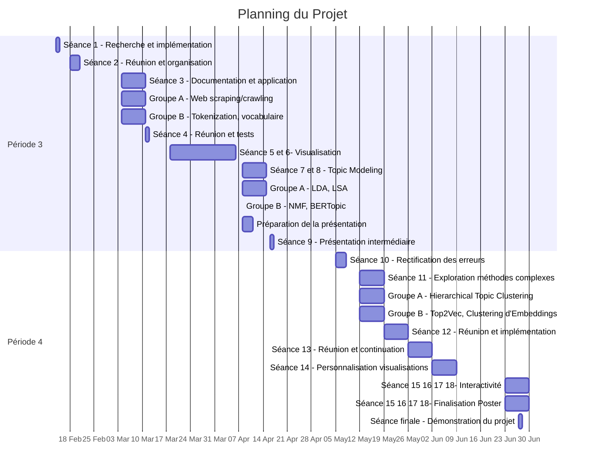

* Planning plus détaillé :
## Période 3

### Séance 1
**14/02**
- Recherche sur les graphes de thèmes et implémentation en Python
- Étude du prétraitement des données, gestion des doublons par clustering et dépôt d’un code de prétraitement basique des données du site
- Documentation sur KeywordScape, utilisation d’allenai-science parse, installation des dépendances
- Recherche sur les nuages de mots et implémentation en Python

### Séance 2
**18/02**
- Réunion avec l’encadrant
- Rédaction du planning
- Répartition des tâches : 2 sous-groupes de 2, groupe A (Lina et Obeye) et groupe B (Mohamed et Rayane)
- Organisation du Git

### Séance 3
**04/03**
- Consulter les deux documents de la bibliographie
- Documentation et application :
  - Groupe A : Web scraping/crawling (Code, Utilisation de Beautiful Soup)
  - Groupe B : Tokenization, vocabulaire (Code, utilisation de NLTK et Spacy)

### Séance 4
**11/03**
- Réunion (max. 40 min) -> présenter et expliquer ce que chaque groupe a fait
- Rassembler le code et rendre la première version de la pipeline
- Conduire des tests sur des pages de Wikipédia
- En cas d’erreur : chaque groupe identifie ses erreurs et adapte le code en conséquence

### Séance 5
**18/03**
- Tester plusieurs méthodes de visualisation (sans LLM) sur les pages Wikipédia comme Nuage de mots ou TreeMap
- Pour chaque méthode : Créer une nouvelle version de la pipeline adaptée à la visualisation et documenter sa version
- Régler les paramètres du nombre de fréquences pour créer un vocabulaire exhaustif

### Séance 6
**25/03**

- Adapter le code de la pipeline pour permettre un pré-traitement de données plus avancé (s2a) - si c’est trop compliqué choisir d’autres sites de données à traiter
- En cas de succès sur une URL de s2a : élaborer une nouvelle version de la pipeline qui peut faire du scrapping sur tout le site web
- Récupération du nom des auteurs, titre des articles, dates et autres informations utiles

### Séance 7
**01/04**
- Réunion (20 min) -> Discuter des problèmes rencontrés, méthodes plus efficaces de filtrage de texte
- Recherche d’outils de comparaison pour quantifier la précision des méthodes de visualisation
- Optimiser la visualisation, utiliser les outils de comparaison précédemment trouvés

### Séance 8
**08/04**
- Réunion : Mise au point sur l’avancement global du projet
- Documentation rapide du principe (mathématique) du Topic Modeling (Décomposition d’une matrice document-terme en deux matrices document-thème et thème-mot)
- Nouvelle répartition des tâches, chaque groupe choisit une méthode de visualisation de thèmes à implémenter, par exemple :
  - Groupe A : LDA, LSA (Latent Semantic Analysis)
  - Groupe B : Non-negative Matrix Factorization (NMF), BERTopic technique (clustering)
- Pour chaque méthode : Identifier les entrées / sorties, après avoir choisi une implémentation.
- Évaluation des modèles élaborés (par chaque groupe) par différentes méthodes (comme le calcul de Perplexity, Coherence score) puis détermination globale de leurs avantages et inconvénients.
- Intégration dans la pipeline et son adaptation pour chaque méthode de visualisation notamment pour que son format de sortie soit compatible avec l’entrée de la méthode de visualisation

**Remarque :** Le graphe de thèmes pourra être réutilisé ultérieurement pour des visualisations plus élaborées.

### Hors-séances
- Continuer les tâches de la séance 8

### Séance 9
**15/04**
- Groupe A : Créer une présentation de notre avancement : PPT
- Groupe B : Concevoir un poster

### Séance 10
**16/04**
- Présentation intermédiaire de fin de période

## Période 4

### Séance 11
**05/05**
- Rectification des erreurs détectées lors de la présentation intermédiaire
- Deuxième essai d’extraction et de pré-traitement des données du LTCI

### Séance 12
**12/05**
- Groupe A : Exploration d’autres méthodes de visualisation plus complexes (par exemple Hierarchical Topic Clustering)
- Groupe B : Approfondissement des méthodes de topic modeling et extraction de concepts intermédiaires (Top2Vec, Clustering d'Embeddings de Mots…)

### Séance 13
**19/05**
- Réunion (max. 30 min) -> présenter et expliquer ce que chaque groupe a fait
- Implémentation des nouvelles méthodes complexes documentées lors de la séance 11 et adapter les codes de Pipelines.

### Séance 14
**26/05**
- Réunion (max. 30 min) -> présenter et expliquer ce que chaque groupe a fait lors de la dernière séance
- Continuer les différentes tâches, modifications éventuelles des codes de prétraitement, traitement des erreurs éventuelles

### Séance 15
**02/06**
- Personnalisation des visualisations (forme)
- Documentation et étude approfondie de l’interactivité, notamment la possibilité de faire de l’interactivité temporelle.

### Séance 16
**23/06**
&
### Séance 17
**24/06**
&
### Séance 18
**25/06**
&
### Séance 19
**26/06**
- Focalisation sur la partie interactive (recours possible à la visualisation par carte thermique ou thématique, ou bien un graphe de thèmes où chaque nœud renferme un nuage de mots)
- Intégration éventuelle de visualisation chronologique
- Finalisation du poster (et d’autres rendus éventuels)
- Préparation de la présentation finale

### Séance finale
**27/06**
- Démonstration du projet
